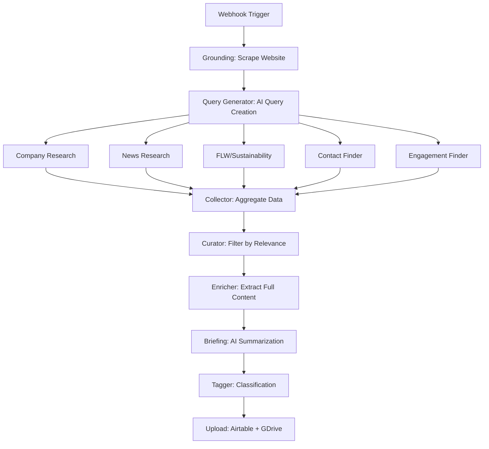

# Company Research Agent

AI-powered research and outreach system for generating comprehensive company reports and personalized emails. Built with LangGraph, FastAPI, and integrated with Airtable and Google Drive.

## 🚀 Features

- **Automated Research Pipeline**: Multi-node LangGraph workflow with parallel research streams
- **AI-Powered Analysis**: Uses GPT-4, Claude, and Gemini for intelligent content generation
- **Airtable Integration**: Seamless sync with Airtable bases for CRM workflows
- **Google Drive Context**: Download existing research to avoid redundant API calls
- **Email Generation**: Template-based personalized outreach with AI customization
- **PDF Reports**: Professional research reports with ReFED styling
- **Real-time Updates**: WebSocket status updates throughout research process
- **Mock Mode**: Test without consuming API credits

## 📋 Quick Start

### Local Development

1. **Clone and setup:**
   ```bash
   git clone https://github.com/erikivester/company-research-agent.git
   cd company-research-agent
   python -m venv .venv
   source .venv/bin/activate  # On Windows: .venv\Scripts\activate
   pip install -r requirements.txt
   ```

2. **Configure environment:**
   ```bash
   cp .env.example .env
   # Edit .env and fill in your API keys
   ```

3. **Run locally:**
   ```bash
   python application.py
   ```

4. **Test:**
   ```bash
   curl http://localhost:8000/health
   ```

### Google Cloud Deployment (Production)

See **[GCLOUD_DEPLOYMENT.md](GCLOUD_DEPLOYMENT.md)** for complete deployment guide.

**Quick deploy:**
```bash
# Setup (first time)
./deploy-gcloud.sh --setup --project-id YOUR_PROJECT_ID

# Deploy
./deploy-gcloud.sh
```

## 📁 Project Structure

```
company-research-agent/
├── application.py              # FastAPI app with all webhooks
├── backend/
│   ├── graph.py               # LangGraph workflow orchestration
│   ├── config.py              # Configuration singleton
│   ├── nodes/                 # Research nodes
│   │   ├── grounding.py      # Website scraping
│   │   ├── query_generator.py # AI query generation
│   │   ├── researchers/       # Parallel research streams
│   │   │   ├── company.py
│   │   │   ├── news.py
│   │   │   ├── flw.py
│   │   │   ├── contact_finder.py
│   │   │   └── engagement_finder.py
│   │   ├── collector.py       # Data collection
│   │   ├── curator.py         # Relevance filtering
│   │   ├── enricher.py        # Content extraction
│   │   ├── briefing.py        # AI summarization
│   │   └── tagger.py          # Classification
│   ├── services/              # External integrations
│   │   ├── email_generator.py
│   │   ├── pdf_service.py
│   │   └── websocket_manager.py
│   └── utils/                 # Utilities
│       ├── gdrive_uploader.py
│       ├── airtable_mappings.py
│       └── mock_tavily.py
├── scripting/                 # Airtable extension (Node.js)
│   └── frontend/
│       └── index.js           # React extension UI
├── Dockerfile                 # Production container
├── deploy-gcloud.sh          # Deployment script
└── requirements.txt          # Python dependencies
```

## 🔌 API Endpoints

All endpoints accessible from single Cloud Run service:

| Endpoint | Method | Purpose |
|----------|--------|---------|
| `/webhook/start-research` | POST | Trigger full research pipeline |
| `/generate-outreach` | POST | Generate personalized email |
| `/generate-pdf` | POST | Generate PDF report |
| `/templates` | GET | List available email templates |
| `/health` | GET | Health check |
| `/auth/token` | POST | JWT authentication |

## 🔧 Configuration

### Environment Variables

Key variables in `.env`:

```bash
# AI APIs
TAVILY_API_KEY=tvly-xxxxx
OPENAI_API_KEY=sk-xxxxx
GEMINI_API_KEY=xxxxx

# Airtable
AIRTABLE_API_KEY=patxxxxx
AIRTABLE_BASE_ID=appxxxxx
AIRTABLE_TABLE_NAME=Companies

# Google Drive
EMAIL_TEMPLATES_FOLDER_ID=1tt4LLouNP2FgHcguIKlnRzRb3j5jE8LH

# Feature Flags
USE_MOCK_DATA=false          # Test without API calls
ENABLE_AIRTABLE_UPLOAD=true
ENABLE_GDRIVE_UPLOAD=true
```

### Google Drive Credentials

Required for:
- Uploading research JSON/PDF files
- Downloading existing research (local context mode)
- Fetching email templates

Setup:
1. Create service account in GCP Console
2. Download JSON key as `gdrive_credentials.json`
3. Share Drive folders with service account email

## 📊 Research Workflow



**Status progression:**
1. Queued
2. In Progress
3. Collecting Data
4. Curating Documents
5. Enriching Content
6. Generating Briefings
7. Classifying
8. Compiling Report
9. Completed

## 🎯 Use Cases

### 1. Research Automation
Trigger from Airtable when new company added:
```bash
curl -X POST https://your-service.run.app/webhook/start-research \
  -H "Content-Type: application/json" \
  -d '{
    "company": "Walmart",
    "airtable_record_id": "recXXXXXXXXXX",
    "google_drive_folder_url": "https://drive.google.com/...",
    "use_local_context": true
  }'
```

### 2. Email Generation
Generate personalized email from Airtable extension:
```bash
curl -X POST https://your-service.run.app/generate-outreach \
  -H "Content-Type: application/json" \
  -d '{
    "template_type": "PARTNERSHIP_INTRO",
    "contact_name": "Jane Smith",
    "airtable_context": {...}
  }'
```

### 3. Local Context Mode
Reuse existing research from Google Drive to save API costs:
- Set `use_local_context: true` in webhook
- System downloads JSON files from Drive folder
- Skips Tavily API calls for existing research
- Significant cost savings for re-research

## 🧪 Testing

### Mock Mode
Test without consuming API credits:

```bash
# In .env
USE_MOCK_DATA=true
TAVILY_API_KEY=  # Leave empty

# Runs with mock Walmart data
```

### Local Testing
```bash
# Health check
curl http://localhost:8000/health

# List templates
curl http://localhost:8000/templates

# Test research (local)
curl -X POST http://localhost:8000/webhook/start-research \
  -H "Content-Type: application/json" \
  -d '{
    "company": "Walmart",
    "airtable_record_id": "recTEST123"
  }'
```

## 📦 Deployment Options

### Option 1: Single Cloud Run Service (Recommended)
- **Cost**: $40-60/month for moderate usage
- **Complexity**: Low
- **Setup**: Use `deploy-gcloud.sh` script
- **Use case**: Most deployments

### Option 2: Docker Compose (Development)
```bash
docker-compose up
```
- Includes ngrok for external access
- Airtable extension dev server
- Good for local development

### Option 3: Multiple Cloud Run Services (Advanced)
- Split by function (research, email, pdf)
- Independent scaling
- Higher complexity and cost

## 📚 Documentation

- **[GCLOUD_DEPLOYMENT.md](GCLOUD_DEPLOYMENT.md)** - Complete GCloud deployment guide
- **[GCLOUD_COMMANDS.md](GCLOUD_COMMANDS.md)** - Quick reference commands
- **[DEPLOYMENT_CHECKLIST.md](DEPLOYMENT_CHECKLIST.md)** - Pre-deployment checklist
- **[LOCAL_CONTEXT_SETUP.md](LOCAL_CONTEXT_SETUP.md)** - Google Drive integration
- **[scripting/README.md](scripting/README.md)** - Airtable extension docs

## 🔐 Security

- Secrets stored in Google Secret Manager (production)
- JWT authentication available for endpoints
- CORS restricted to Airtable domains
- Service account with minimal permissions
- No secrets in container images

## 💰 Cost Estimation

**API Costs (per research job):**
- Tavily API: ~$0.10-0.30 (can reduce with local context)
- OpenAI GPT-4: ~$0.50-1.00
- Gemini: ~$0.05-0.10

**Infrastructure (GCP):**
- Cloud Run: ~$0.01-0.02 per job
- Storage: Negligible
- **Total**: ~$40-60/month for 100 jobs

**Cost Optimization:**
- Use `use_local_context: true` to reuse research
- Set `min-instances: 0` for dev environments
- Use mock mode for testing

## 🛠️ Troubleshooting

### Common Issues

**"Permission denied" on deployment**
```bash
# Grant Cloud Build permissions
gcloud projects add-iam-policy-binding YOUR_PROJECT_ID \
  --member="serviceAccount:PROJECT_NUMBER@cloudbuild.gserviceaccount.com" \
  --role="roles/run.admin"
```

**"Secret not found"**
```bash
# Create secrets
gcloud secrets create research-env --data-file=.env
gcloud secrets create gdrive-credentials --data-file=gdrive_credentials.json
```

**Airtable extension can't reach service**
- Verify URL has no trailing slash
- Check CORS settings in `application.py`
- Ensure service is `--allow-unauthenticated`

**See logs:**
```bash
gcloud run logs tail company-research-agent --region us-central1
```

## 🤝 Contributing

1. Fork the repository
2. Create feature branch: `git checkout -b feature-name`
3. Commit changes: `git commit -am 'Add feature'`
4. Push to branch: `git push origin feature-name`
5. Submit Pull Request

## 📝 License

MIT License - see [LICENSE](LICENSE) file

## 🔗 Resources

- **LangGraph**: https://langchain-ai.github.io/langgraph/
- **FastAPI**: https://fastapi.tiangolo.com/
- **Airtable API**: https://airtable.com/developers/web/api
- **Google Cloud Run**: https://cloud.google.com/run/docs
- **Tavily API**: https://tavily.com/

## 📧 Support

For questions or issues:
- Open an issue on GitHub
- Check existing documentation
- Review Cloud Run logs for errors

---

**Ready to deploy?** See [GCLOUD_DEPLOYMENT.md](GCLOUD_DEPLOYMENT.md)

**Need help?** Check [DEPLOYMENT_CHECKLIST.md](DEPLOYMENT_CHECKLIST.md)

**Quick commands?** See [GCLOUD_COMMANDS.md](GCLOUD_COMMANDS.md)
